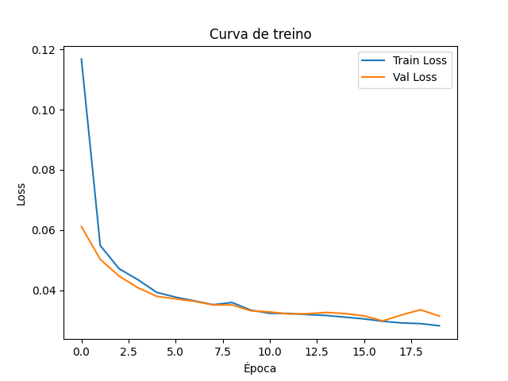
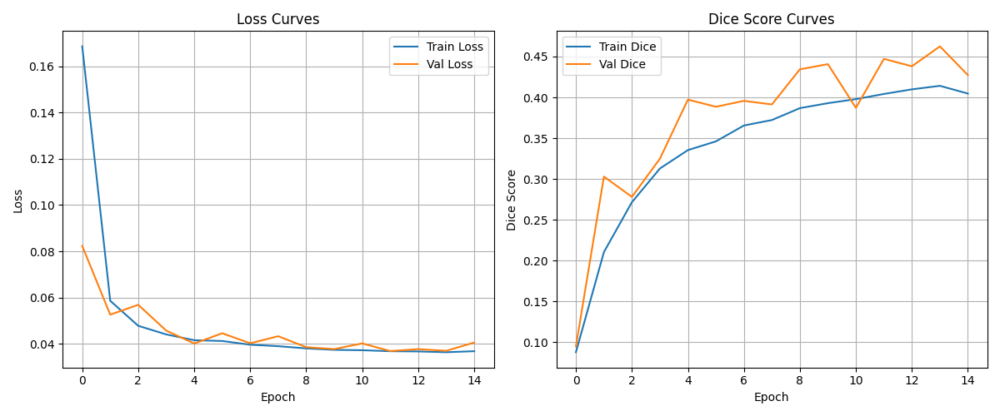
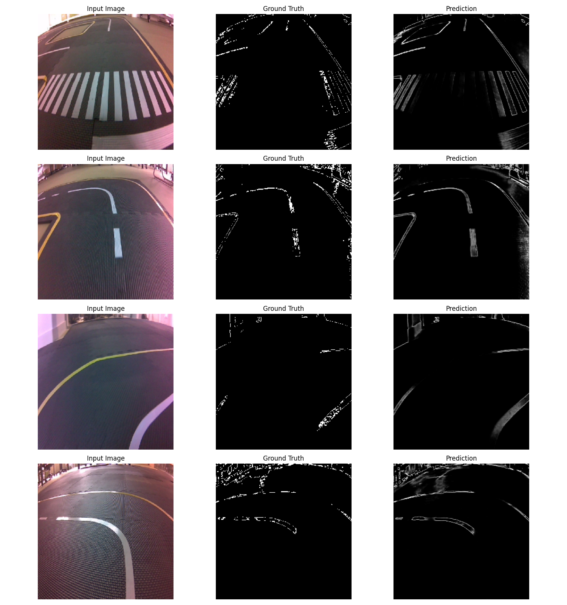

# JetCar Lane Follower — Segmentação com U-Net + TensorRT

## 🚗 Introdução

Projeto de condução autónoma usando Jetson Nano com visão por computador. A deteção de linhas na pista é feita com um modelo de segmentação U-Net treinado com imagens reais e máscaras geradas por OpenCV. O sistema converte a saída segmentada em ângulos de direção, permitindo ao carro seguir linhas de forma robusta e explicável.

## 🧠 Ideia e Justificação do Treino

**Objetivo:** Permitir que o carro siga linhas (curvas e retas) usando uma rede de segmentação que aprende a reconhecer as linhas tal como um humano faria.

### Geração dos dados (Dataset)

* Imagens capturadas diretamente com a câmara do JetCar em múltiplos cenários:

  * Curvas apertadas
  * Retas
  * Condições variadas de luz e sombras

* Para cada imagem foi criada uma **máscara binária**:

  * Filtragem de cores (HSV)
  * Canny edges
  * Morfologia para reduzir ruído

### Porquê Segmentação?

* **Generalização:** Aprende a reconhecer linhas mesmo sob variações (luz, sombras, desgaste do piso).
* **Explicabilidade:** Saída visível (máscara), fácil de auditar.
* **Flexibilidade:** Podemos mudar a lógica de controlo sem re-treinar o modelo.
 

### Filosofia do controlo

1. O modelo prevê a máscara (linha navegável).
2. Procuramos o **ponto mais próximo** no fundo da imagem.
3. Se não houver ponto (linha desapareceu), usamos o último ponto conhecido (ghost point).
4. Calculamos o **ângulo** entre o centro do carro e o ponto.
5. Suavizamos o ângulo com histórico e convertemos para direção do volante.

**Nota:**

* Treinar o ângulo diretamente seria opaco e menos flexível.
* Técnicas como Hough falham facilmente com ruído ou linhas gastas.

## 🔨 Arquitetura do Sistema

### Pipeline de treino

1. Captura de imagens com Nano
2. Criação de máscaras com OpenCV
3. Treino do modelo U-Net
4. Exportação do modelo para ONNX e conversão para TensorRT (.engine)

### Pipeline de inferência (tempo real)

1. Leitura da câmara com GStreamer
2. Preprocessamento da imagem
3. Inferência TensorRT → máscara
4. Cálculo do ponto alvo e ângulo
5. Aplicação de ângulo e velocidade

## 🏋️‍♂️ Treino

 
### Curvas de treino

### Previsões durante treino

* Epoch 5:

* Epoch 10:

* Epoch 15:

## ⚙️ Execução no Jetson (Tempo real)

 

1. Carrega o motor TensorRT (`unet_model.engine`)
2. Captura frames da câmara
3. Faz inferência → máscara binária
4. Calcula ponto alvo e ângulo
5. Aplica comando ao Nano
 
 